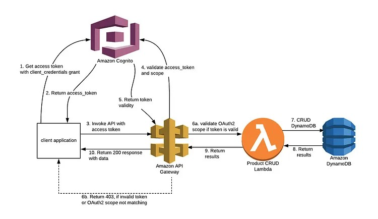

# 🔐 Streamlit Cognito Admin Console

This Streamlit app provides a secure login via Amazon Cognito and an admin-only interface to toggle AWS WAF protection via API Gateway.

---

## 🚀 Features

- ✅ Secure login using Cognito Hosted UI
- 🔑 OAuth 2.0 Authorization Code Grant flow
- 🔐 ID token decoding and admin role check
- 📡 View current WAF mode (normal/block)
- 🔄 Toggle WAF mode with confirmation
- 👤 Logout and session clearing

---

## 📁 Project Structure

```
streamlit-cognito-waf-toggle/
├── .streamlit/
│   └── secrets.toml              # Configuration (NOT committed)
├── main.py                       # Login and callback handler
├── pages/
│   └── toggle_waf.py             # Admin WAF toggle interface
├── requirements.txt
└── README.md
```

---

## 🔧 Setup Instructions

### 1. 📦 Install dependencies

```bash
pip install -r requirements.txt
```

### 2. 🔐 Set Up Secrets

Create `.streamlit/secrets.toml`:

```toml
AWS_REGION = "ap-northeast-1"
COGNITO_DOMAIN = "https://waf-toggle-ui-demo.auth.ap-northeast-1.amazoncognito.com"
COGNITO_CLIENT_ID = "r54r5gl922l46r2s2ea6nh84b"
COGNITO_REDIRECT_URI = "http://localhost:8501/"
API_GATEWAY_URL = "https://82tmqa6o96.execute-api.ap-northeast-1.amazonaws.com/prod/toggle"
```

> ⚠️ Ensure the redirect URI matches the one registered in your Cognito app client.

---

## ▶️ Run the App

```bash
streamlit run main.py
```

---

## 🔁 App Flow

1. User accesses `main.py` and clicks **login** link
2. Cognito Hosted UI handles authentication
3. User is redirected back with `code=...`
4. App exchanges code for an `id_token`
5. Decoded user profile is shown
6. If in `admin` group → access `Toggle WAF` page
7. Toggle WAF mode (`normal` or `block`) with confirmation

---

## 🛡️ Access Control

- Only users in **`admin`** group (Cognito) may access `toggle_waf.py`
- `id_token` is decoded to enforce this
- Expired tokens are rejected

---

## 🚪 Logout Flow

Clicking **Logout** will:
- Clear session state
- Redirect to Cognito logout endpoint
- Return to `redirect_uri`

---

## ⚠️ Security Notes

- This prototype skips **JWT signature validation**
- For production, validate JWT using Cognito's JWKS
- Never expose client secrets (this app uses public flow)

---


https://awskarthik82.medium.com/part-1-securing-aws-api-gateway-using-aws-cognito-oauth2-scopes-410e7fb4a4c0


## 📜 License

MIT